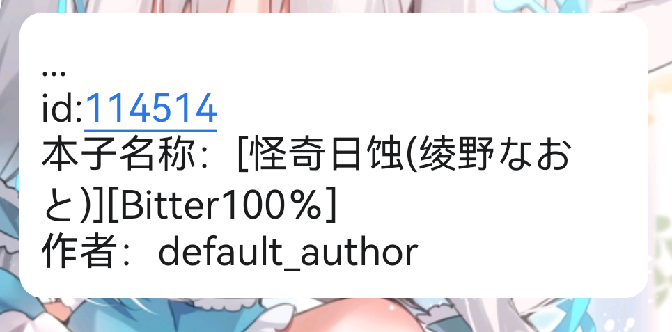
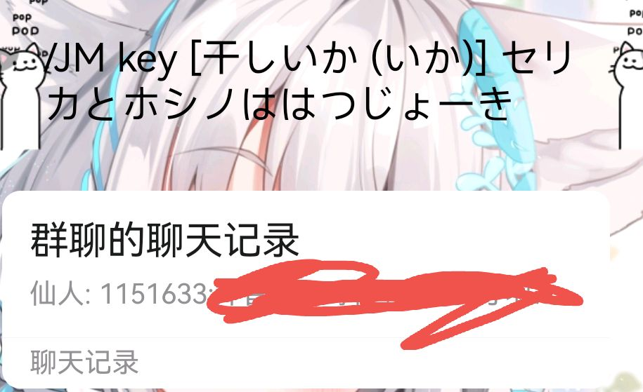

# Astrbot_Plugins_JMPlugins
## 简介
你是否有经历发现神秘id兴冲冲点进去发现是地雷的情景？你是否经历过在外面水群看到一堆神秘id，却不敢点开查看的情景？
别担心！这款插件正是为你解决这些难题而生！只需提供JMid，它能帮你快速查询神秘作品的详细信息，甚至还能选择是否发送封面图，

## 依赖
运行本插件需要安装以下包：  
[jmcomic](https://github.com/hect0x7/JMComic-Crawler-Python)  
[PicImageSearch](https://github.com/kitUIN/PicImageSearch)
十分感谢以上作者提供的API。

根据项目里面的requirements.txt安装依赖包。

**此外，本插件依赖于Aiocqhttp，仅测试过NapCat可以正常使用，请窒息。**

## 功能
1 .根据id查询作品  
指令格式： /JM name id/包含神秘id的句子  
   比如: /JM name 114514  
        /JM name 114抽出了51个彩，其中只有4个new **(句子>10个字并且当中不能有换行)**

输出：若选择开启发送图片，则会返回作品的名字，作者，以及封面图。若选择关闭发送图片，则会返回作品的名字，作者。  
**请根据自己具体使用情况选择开启或者关闭发送图片的功能**  
2.根据key查询作品   
指令格式:/JM key keyword  
输出：搜索到的相关作品的名字以及id

3.Rand随机功能  
指令格式： /JM rand  
输出：随机返回一个神秘作品的名字，作者和id。

4.搜索功能（使用的ASCii2d）  
指令格式： 回复指定图片，输入/search,即可开始搜索。  
输出：搜索到类似图片的url。  

*搜索的结果不是特别准确，请谨慎使用.*

5 .查询月/周/日排行榜  
指令格式： /JM rank m/w/d/a
输出：按照浏览次数排序的月/周/日/总排行榜。

6.权限管理  
指令格式： /JM promote/demote group/user groupid/userid    
例如：/JM promote group 123456789 

**注意：该指令仅限管理员使用，需要在Astrbot控制台给对应账号添加为管理员才能使用。**

6.查看历史记录  
指令格式： /JM history  
输出：包含所有查询过的神秘作品的id和名字，以json格式输出。  

## 版本问题：
若您的astrbot版本比较早，可能没有此函数：
```
datadir = StarTools.get_data_dir("astrbot_plugins_JMPlugins")
```
如果遇到这种情况，请根据以下方法进行修改：
把这段代码
```
#导入包
from astrbot.api.star import StarTools
# 加载白名单
global datadir, white_list_path, history_json_path
datadir = StarTools.get_data_dir("astrbot_plugins_JMPlugins")
print(datadir)        
white_list_path = os.path.join(datadir, "white_list.json")
history_json_path = os.path.join(datadir, "history.json")
```
当中的导入删除，以及下面的加载白名单代码修改为
```
global white_list_path, history_json_path
white_list_path="./data/plugins/astrbot_plugins_JMPlugins/white_list.json"
history_json_path="./data/plugins/astrbot_plugins_JMPlugins/history.json"
```

## 使用
1. 下载本插件，将本插件放入plugins文件夹下。

2. 如果是大陆地区使用，需要修改一下代理的设置：    
找到文件夹里面的option.yml，找到下面这一行选项
``` 
proxies: {
       https: 127.0.0.1:12334 //修改为自己设置好的代理
      }
```
将代理设置替换为自己已经开启的代理设置。

3.安装[jmcomic](https://github.com/hect0x7/JMComic-Crawler-Python)和[PicImageSearch](https://github.com/kitUIN/PicImageSearch)两个包。

4.设置是否发送封面以及cd时间。
目前插件默认是关闭发送封面，以及cd为15秒。若需要更改，在插件控制台里面修改即可。

*注意:cd是全局共享的，我懒得分群写:)*

5.为开用的私聊qq号或者群聊添加权限。
指令： /JM promote/demote group/user groupid/userid  
    例如：/JM promote group 123456789   
    例如：/JM demote user 123456789  

*为了预防内鬼写的白名单:(*

## 插件示例
不带封面查询id：

带封面查询id：

搜索功能：


## 声明
**使用本插件可能导致qq被击毙，请谨慎使用或者查询是否有内鬼再使用。**  
**使用本插件可能导致qq被击毙，请谨慎使用或者查询是否有内鬼再使用。**  
**使用本插件可能导致qq被击毙，请谨慎使用或者查询是否有内鬼再使用。**  


## 更新：
2025/5/10
添加了控制台修改配置的功能。  
修复了无法正常发送历史记录json的问题。

